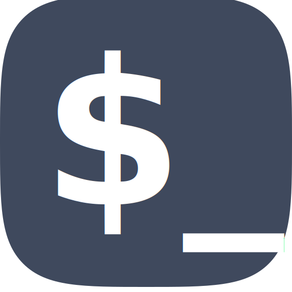

<p align="center">
	
</p>

# Godot Console

<!-- ALL-CONTRIBUTORS-BADGE:START - Do not remove or modify this section -->
[](#contributors-)
<!-- ALL-CONTRIBUTORS-BADGE:END -->


In-game console for Godot, which could be easily extended with new commands.

- [Godot Console](#godot-console)
  - [Features:](#features)
  - [Installation:](#installation)
    - [Via Editor AssetLib:](#via-editor-assetlib)
    - [Via GIT:](#via-git)
  - [Example usage:](#example-usage)
    - [GDScript](#gdscript)
    - [C#](#c)
    - [C# with wrapper (Note this is WIP and some methods may be missing)](#c-with-wrapper)
  - [Contributors ✨](#contributors-)
  - [License](#license)

## Features:

- Creating custom commands with [add_command](addons/quentincaffeino/console/docs/generated/Console.md#add_command).

- Autocomplete with `TAB` keyboard key.

- Writing to console using [write](addons/quentincaffeino/console/docs/generated/Console.md#write) and [write_line](addons/quentincaffeino/console/docs/generated/Console.md#write_line) methods.
  You can also use [BB codes](https://docs.godotengine.org/en/stable/tutorials/gui/bbcode_in_richtextlabel.html#using-bbcode).

  (Is also printed to engine output)

- Session command history (using `UP` and `DOWN` keyboard arrows).

  - Change the number of stored commands in the history. (Change in `Console.gd` line 30 the current NUMBER to an positive integer value)
    `29: var History = preload('Misc/History.gd').new(NUMBER) setget _set_readonly`

- [Flexible types](addons/quentincaffeino/console/docs/Type.md):

  - [Engine types](addons/quentincaffeino/console/docs/Type.md#engine-types)
  - [Extra types](addons/quentincaffeino/console/docs/Type.md#extra-types)
  - [Custom types](addons/quentincaffeino/console/docs/Type.md#creating-custom-types)

- [FuncRef](https://docs.godotengine.org/en/stable/classes/class_funcref.html) support with Godot >=3.2 (can be used as a command target).

## Installation:

### Via Editor AssetLib:

1. Open AssetLib.
2. Search for Console, category is Scripts; Open it and click Download and then Install.
3. Click install. Package installer will copy filestructure as-is so you will have this directories in your project: `addons/quentincaffeino/*`.
4. Open `Project > Project Settings > Plugins`, search for `quentincaffeino-console` and check the Enable checkbox.
5. You can activate the console with <kbd>CTRL</kbd> + <kbd>\`</kbd> while running your game ([can be changed](https://docs.godotengine.org/en/stable/tutorials/inputs/input_examples.html#inputmap), see `quentincaffeino_console_toggle` action).

### Via GIT:

1. Clone this project or download latest [release](https://github.com/quentincaffeino/godot-console/archive/master.zip).
2. Copy `./addons/quentincaffeino` into your projects `addons` folder.

So you will have this structure:

```
res://
├── addons
│   ├── quentincaffeino
│   ├── ...

```

3. Open `Project > Project Settings > Plugins`, search for `quentincaffeino-console` and check the Enable checkbox.
4. You can activate the console with <kbd>CTRL</kbd> + <kbd>\`</kbd> while running your game ([can be changed](https://docs.godotengine.org/en/stable/tutorials/inputs/input_examples.html#inputmap), see `quentincaffeino_console_toggle` action).

## Example usage:

Usage we will get:

```
$ sayHello "Adam Smith"
Hello Adam Smith!
```

### GDScript

```gdscript
# Function that will be called by our command
func print_hello(name = ''):
	Console.write_line('Hello ' + name + '!')

func _ready():
	# Registering command
	# 1. argument is command name
	# 2. arg. is target (target could be a funcref)
	# 3. arg. is target name (name is not required if it is the same as first arg or target is a funcref)
	Console.add_command('sayHello', self, 'print_hello')\
		.set_description('Prints "Hello %name%!"')\
		.add_argument('name', TYPE_STRING)\
		.register()
```

### C#

```cs
// Function that will be called by our command
public string PrintHello(string name = null) {
	GD.Print("Hello " + name + "!");
	return "test";
}

public override void _Ready()
{
	// Registering command
	// 1. argument is command name
	// 2. arg. is target (target could be a funcref)
	// 3. arg. is target name (name is not required if it is the same as first arg or target is a funcref)
	(((GetNode("/root/Console").Call("add_command", "sayHello", this, "PrintHello") as Godot.Object)
		.Call("set_description", "prints \"hello %name%!\"") as Godot.Object)
		.Call("add_argument", "name", Variant.Type.String) as Godot.Object)
		.Call("register");
}
```

### C# with wrapper (Note this is WIP and some methods may be missing)

1. Instead of enabling the `Console` checkbox from the addon tab you will want to enable `CSharpConsole` via the plugin checkbox
2. See the example below for how to use once plugin is enabled

Example:

```cs
public override void _Ready()
{
    _wrapper = GetTree().Root.GetNode<Console>("CSharpConsole");
    _wrapper.AddCommand("sayHello", this, nameof(PrintHello))
            .SetDescription("prints \"hello %name%!\"")
            .AddArgument("name", Variant.Type.String)
            .Register();
}

public void PrintHello(string name = null) {
    GD.Print($"Hello {name}!");
}

```

## Contributors ✨

Thanks goes to these wonderful people ([emoji key](https://allcontributors.org/docs/en/emoji-key)):

<!-- ALL-CONTRIBUTORS-LIST:START - Do not remove or modify this section -->
<!-- prettier-ignore-start -->
<!-- markdownlint-disable -->
<table>
  <tr>
    <td align="center"><a href="http://gitlab.com/QuentinCaffeino"><br /><sub><b>Sergei ZH</b></sub></a><br /><a href="https://github.com/quentincaffeino/godot-console/commits?author=quentincaffeino" title="Code">💻</a> <a href="#question-quentincaffeino" title="Answering Questions">💬</a> <a href="https://github.com/quentincaffeino/godot-console/commits?author=quentincaffeino" title="Documentation">📖</a> <a href="#ideas-quentincaffeino" title="Ideas, Planning, & Feedback">🤔</a> <a href="https://github.com/quentincaffeino/godot-console/pulls?q=is%3Apr+reviewed-by%3Aquentincaffeino" title="Reviewed Pull Requests">👀</a></td>
    <td align="center"><a href="http://www.underflowstudios.com"><br /><sub><b>Michael Brune</b></sub></a><br /><a href="#a11y-MJBrune" title="Accessibility">️️️️♿️</a> <a href="https://github.com/quentincaffeino/godot-console/issues?q=author%3AMJBrune" title="Bug reports">🐛</a></td>
    <td align="center"><a href="https://github.com/aganm"><br /><sub><b>Michael Aganier</b></sub></a><br /><a href="https://github.com/quentincaffeino/godot-console/issues?q=author%3Aaganm" title="Bug reports">🐛</a></td>
    <td align="center"><a href="https://github.com/hpn33"><br /><sub><b>hpn332</b></sub></a><br /><a href="https://github.com/quentincaffeino/godot-console/issues?q=author%3Ahpn33" title="Bug reports">🐛</a></td>
    <td align="center"><a href="https://github.com/danilw"><br /><sub><b>Danil</b></sub></a><br /><a href="https://github.com/quentincaffeino/godot-console/issues?q=author%3Adanilw" title="Bug reports">🐛</a></td>
    <td align="center"><a href="http://sdnllc.com"><br /><sub><b>Paul Hocker</b></sub></a><br /><a href="https://github.com/quentincaffeino/godot-console/issues?q=author%3Apaulhocker" title="Bug reports">🐛</a></td>
    <td align="center"><a href="https://github.com/SamanthaClarke1"><br /><sub><b>Samantha Clarke</b></sub></a><br /><a href="https://github.com/quentincaffeino/godot-console/issues?q=author%3ASamanthaClarke1" title="Bug reports">🐛</a></td>
    <td align="center"><a href="https://hugo.pro"><br /><sub><b>Hugo Locurcio</b></sub></a><br /><a href="#a11y-Calinou" title="Accessibility">️️️️♿️</a></td>
  </tr>
  <tr>
    <td align="center"><a href="https://github.com/DmDerbin"><br /><sub><b>Dmitry Derbin</b></sub></a><br /><a href="#question-DmDerbin" title="Answering Questions">💬</a></td>
    <td align="center"><a href="https://github.com/VitexHD"><br /><sub><b>VitexHD</b></sub></a><br /><a href="https://github.com/quentincaffeino/godot-console/issues?q=author%3AVitexHD" title="Bug reports">🐛</a></td>
    <td align="center"><a href="https://github.com/hilfazer"><br /><sub><b>hilfazer</b></sub></a><br /><a href="https://github.com/quentincaffeino/godot-console/commits?author=hilfazer" title="Code">💻</a> <a href="https://github.com/quentincaffeino/godot-console/issues?q=author%3Ahilfazer" title="Bug reports">🐛</a></td>
    <td align="center"><a href="https://github.com/crazychenz"><br /><sub><b>Crazy Chenz</b></sub></a><br /><a href="https://github.com/quentincaffeino/godot-console/commits?author=crazychenz" title="Code">💻</a></td>
    <td align="center"><a href="https://github.com/Japortie"><br /><sub><b>Marcus Schütte</b></sub></a><br /><a href="https://github.com/quentincaffeino/godot-console/commits?author=Japortie" title="Code">💻</a></td>
    <td align="center"><a href="https://github.com/Cryszon"><br /><sub><b>Kimmo Salmela</b></sub></a><br /><a href="https://github.com/quentincaffeino/godot-console/commits?author=Cryszon" title="Code">💻</a></td>
    <td align="center"><a href="https://github.com/GuillaumeCailhe"><br /><sub><b>GuillaumeCailhe</b></sub></a><br /><a href="https://github.com/quentincaffeino/godot-console/issues?q=author%3AGuillaumeCailhe" title="Bug reports">🐛</a> <a href="#ideas-GuillaumeCailhe" title="Ideas, Planning, & Feedback">🤔</a> <a href="#question-GuillaumeCailhe" title="Answering Questions">💬</a></td>
    <td align="center"><a href="https://github.com/joshdegraw"><br /><sub><b>Josh DeGraw</b></sub></a><br /><a href="https://github.com/quentincaffeino/godot-console/commits?author=joshdegraw" title="Code">💻</a></td>
  </tr>
  <tr>
    <td align="center"><a href="https://discordapp.com/invite/hSey9Bv"><br /><sub><b>Lyaaaaaaaaaaaaaaa</b></sub></a><br /><a href="#infra-Lyaaaaaaaaaaaaaaa" title="Infrastructure (Hosting, Build-Tools, etc)">🚇</a></td>
    <td align="center"><a href="http://gamemap.github.io"><br /><sub><b>Gamemap</b></sub></a><br /><a href="https://github.com/quentincaffeino/godot-console/commits?author=Gamemap" title="Documentation">📖</a></td>
    <td align="center"><a href="http://Spyrex.me"><br /><sub><b>Spyrex</b></sub></a><br /><a href="https://github.com/quentincaffeino/godot-console/commits?author=SpyrexDE" title="Code">💻</a></td>
    <td align="center"><a href="https://github.com/Zhwt"><br /><sub><b>Zhwt</b></sub></a><br /><a href="https://github.com/quentincaffeino/godot-console/commits?author=Zhwt" title="Code">💻</a></td>
    <td align="center"><a href="https://github.com/ryan-linehan"><br /><sub><b>Ryan Linehan</b></sub></a><br /><a href="https://github.com/quentincaffeino/godot-console/commits?author=ryan-linehan" title="Code">💻</a></td>
    <td align="center"><a href="https://github.com/Braboware"><br /><sub><b>Kurt</b></sub></a><br /><a href="https://github.com/quentincaffeino/godot-console/commits?author=Braboware" title="Documentation">📖</a></td>
  </tr>
</table>

<!-- markdownlint-restore -->
<!-- prettier-ignore-end -->

<!-- ALL-CONTRIBUTORS-LIST:END -->

This project follows the [all-contributors](https://github.com/all-contributors/all-contributors) specification. Contributions of any kind welcome!

## License

Licensed under the MIT license, see `LICENSE.md` for more information.
